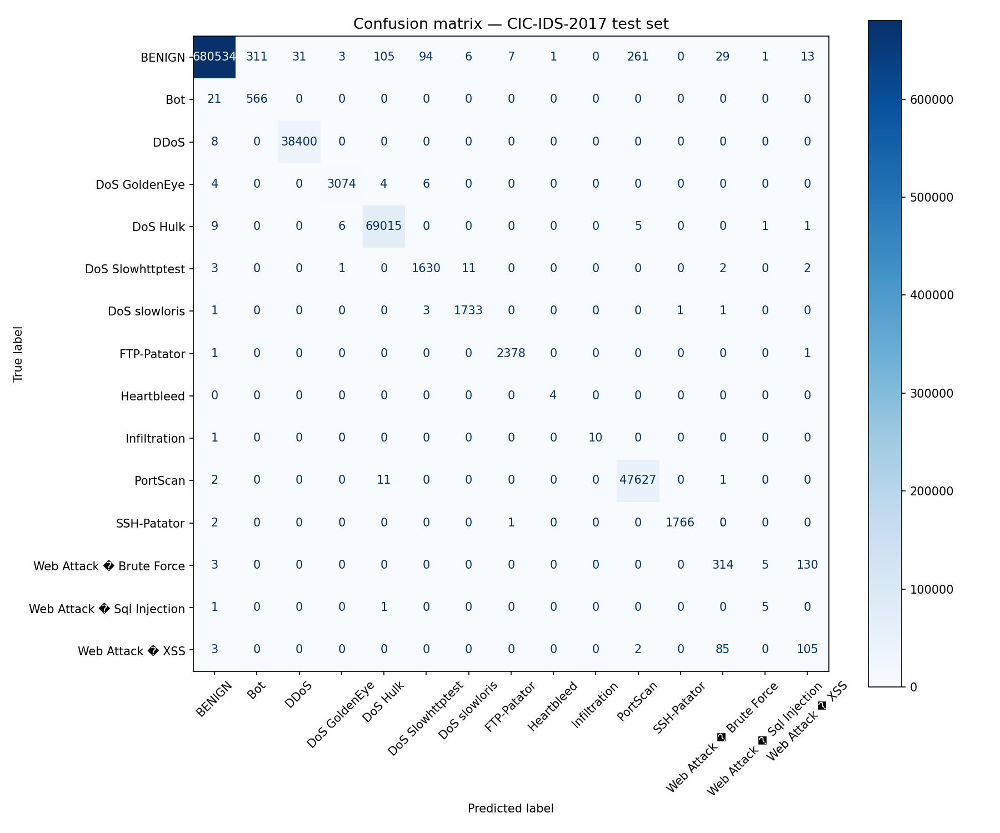
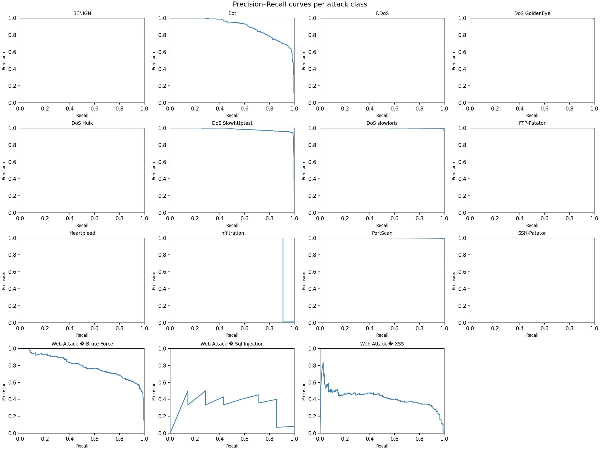
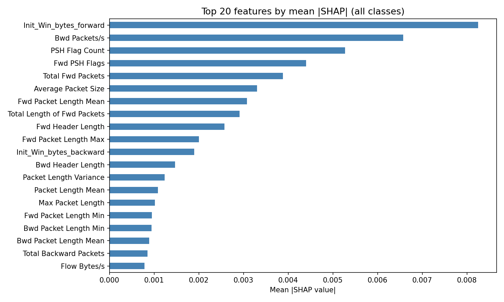

# 🛡️ NIDS Sentinel — Network Intrusion Detection System

A full-stack, ML-powered Network Intrusion Detection System trained on the **CIC-IDS-2017** dataset. Detects 14 attack categories in real time using an XGBoost classifier with an Isolation Forest anomaly fallback, served via a FastAPI backend and visualised through a live Streamlit dashboard.

---

## Table of Contents

- [Tech Stack](#tech-stack)
- [Repository Structure](#repository-structure)
- [Dataset](#dataset)
- [Setup and Installation](#setup-and-installation)
- [Running the System](#running-the-system)
- [API Reference](#api-reference)
- [Model Performance](#model-performance)
- [Attack Classes](#attack-classes)
- [Running Tests](#running-tests)
- [Configuration](#configuration)
- [License](#license)

---

## Tech Stack

| Layer | Technology |
|-------|-----------|
| ML Models | XGBoost 1.7.6, Isolation Forest (scikit-learn) |
| Explainability | SHAP 0.45.1 |
| Backend API | FastAPI + Uvicorn |
| Dashboard | Streamlit + Plotly |
| Packet Capture | Scapy |
| Containerisation | Docker + Docker Compose |
| Testing | pytest |

---

## Repository Structure

```
NIDS-Network-Intrusion-Detection-System/
│
├── app/                          # FastAPI backend package
│   ├── __init__.py
│   ├── main.py                   # API entrypoint (/predict, /health, /alerts, /labels, /sample)
│   ├── predictor.py              # XGBoost + Isolation Forest inference pipeline
│   ├── alerting.py               # SIEM alert builder & webhook dispatcher
│   ├── feature_extractor.py      # Computes all 77 CIC-IDS-2017 features from a FlowRecord
│   ├── flow.py                   # In-memory flow tracking (FlowKey, PacketRecord, FlowRecord)
│   └── schema.py                 # Pydantic v2 request model (FlowFeatures — 77 aliased fields)
│
├── tests/
│   └── tests.py                  # pytest suite covering flow, features, predictor, alerting & API
│
├── assets/                       # Evaluation plots — commit these so they render on GitHub
│   ├── confusion_matrix_cic.png
│   ├── precision_recall_curves.png
│   └── shap_global_importance.png
│
├── models/                       # ⚠️ NOT in repo — generated by running the notebook (see Setup)
│   ├── xgb_nids.joblib
│   ├── iso_forest.joblib
│   ├── label_encoder.joblib
│   ├── feature_columns.json
│   └── sample_flow.json
│
├── data/                         # ⚠️ NOT in repo — download from Kaggle (see Dataset)
│   └── CIC-IDS-2017/
│       └── *.csv
│
├── nids_data_team.ipynb          # End-to-end notebook: EDA → training → model export
├── ui_dashboard.py               # Streamlit real-time dashboard
├── Dockerfile                    # Backend container (Python 3.11-slim)
├── docker-compose.yml            # Spins up backend (8000) + UI (8501) together
├── backend_requirements.txt      # Backend dependencies
├── ui_requirements.txt           # Dashboard dependencies
└── README.md
```

---

## Dataset

This project uses the **CIC-IDS-2017** dataset by the Canadian Institute for Cybersecurity.

🔗 **Download from Kaggle:** [https://www.kaggle.com/datasets/cicdataset/cicids2017]([https://www.kaggle.com/datasets/chethuhn/network-intrusion-dataset])

After downloading, place the CSV files at `data/CIC-IDS-2017/` in the project root:

```
data/
└── CIC-IDS-2017/
    ├── Monday-WorkingHours.pcap_ISCX.csv
    ├── Tuesday-WorkingHours.pcap_ISCX.csv
    ├── Wednesday-workingHours.pcap_ISCX.csv
    ├── Thursday-WorkingHours-Morning-WebAttacks.pcap_ISCX.csv
    ├── Thursday-WorkingHours-Afternoon-Infilteration.pcap_ISCX.csv
    ├── Friday-WorkingHours-Morning.pcap_ISCX.csv
    ├── Friday-WorkingHours-Afternoon-PortScan.pcap_ISCX.csv
    └── Friday-WorkingHours-Afternoon-DDos.pcap_ISCX.csv
```

> The notebook reads from this path by default. Update the data directory variable in its first cell if your path differs.

---

## Setup and Installation

### Step 1 — Clone the repository

```bash
git clone https://github.com/vidurr01/NIDS-Network-Intrusion-Detection-System-.git
cd NIDS-Network-Intrusion-Detection-System-
```

### Step 2 — Download the dataset

Download CIC-IDS-2017 from the Kaggle link above and place the CSVs under `data/CIC-IDS-2017/` as shown above.

### Step 3 — Train the models

Open `nids_data_team.ipynb` and run all cells. Section 2.7 exports the following files into a `models/` folder at the project root:

```
models/
├── xgb_nids.joblib         ← XGBoost classifier
├── iso_forest.joblib       ← Isolation Forest (anomaly fallback)
├── label_encoder.joblib    ← Fitted LabelEncoder
├── feature_columns.json    ← Ordered list of 77 feature names
└── sample_flow.json        ← One test row (used by GET /sample)
```

> ⚠️ **XGBoost version lock:** The notebook trains with `xgboost==1.7.6`. The backend is pinned to the same version. Do not upgrade XGBoost without retraining and updating `backend_requirements.txt`.

---

## Running the System

### Option A — Docker Compose (recommended)

```bash
# Make sure models/ is populated first (Step 3 above)
docker-compose up --build
```

| Service | URL |
|---------|-----|
| Backend API | http://localhost:8000 |
| Interactive API docs | http://localhost:8000/docs |
| Streamlit Dashboard | http://localhost:8501 |

### Option B — Local (no Docker)

**Terminal 1 — Backend:**
```bash
pip install -r backend_requirements.txt
uvicorn app.main:app --reload --port 8000
```

**Terminal 2 — Dashboard:**
```bash
pip install -r ui_requirements.txt
streamlit run ui_dashboard.py
```

To point the dashboard at a remote backend:
```bash
UI_API_BASE=http://your-host:8000 streamlit run ui_dashboard.py
```

---

## API Reference

| Method | Endpoint | Description |
|--------|----------|-------------|
| `GET` | `/health` | Liveness check |
| `GET` | `/labels` | All class names from the trained LabelEncoder |
| `GET` | `/sample` | A real CIC-IDS-2017 test row — paste into `/predict` to test |
| `POST` | `/predict` | Submit 77 CIC-IDS-2017 features; returns label + confidence + SHAP |
| `GET` | `/alerts` | Tail the last N alerts from the JSONL log (e.g. `?n=50`) |

Full interactive docs at **http://localhost:8000/docs** when the backend is running.

### Inference Pipeline

Each call to `POST /predict` runs the following logic:

```
Input (77 features)
       │
       ▼
  XGBoost classifier
       │
       ├─ confidence ≥ 0.80 ──► return label + SHAP values
       │
       └─ confidence < 0.80 ──► Isolation Forest
                                      │
                                      ├─ normal  ──► return XGBoost label
                                      └─ anomaly ──► "Unknown/Novel Attack"

  If label ≠ BENIGN ──► fire SIEM alert (JSONL log + optional webhook)
```

### Quick Test with `curl`

```bash
# 1. Get a real sample payload
curl http://localhost:8000/sample

# 2. Run a prediction
curl -X POST http://localhost:8000/predict \
  -H "Content-Type: application/json" \
  -d @models/sample_flow.json
```

---

## Model Performance

All plots below are generated by `nids_data_team.ipynb` and stored in `assets/` so they render directly on GitHub.

### Confusion Matrix


### Precision–Recall Curves (per attack class)


### Top 20 Features by Mean |SHAP| Value


The most influential features across all attack classes are `Init_Win_bytes_forward`, `Bwd Packets/s`, `PSH Flag Count`, `Fwd PSH Flags`, and `Total Fwd Packets`.

---

## Attack Classes

The model classifies traffic into 14 attack categories plus a novel anomaly label:

| Severity | Labels |
|----------|--------|
| 🔴 **HIGH** | DDoS, DoS GoldenEye, DoS Hulk, DoS Slowhttptest, DoS slowloris, Heartbleed, Web Attack – Brute Force |
| 🟡 **MEDIUM** | PortScan, FTP-Patator, SSH-Patator, Web Attack – XSS, Web Attack – SQL Injection, Infiltration, Bot |
| 🔵 **INFO** | Unknown/Novel Attack *(Isolation Forest anomaly — severity unknown)* |
| ✅ **NONE** | BENIGN *(no alert fired)* |

---

## Running Tests

The test suite requires real model files in `models/` (generated in Setup Step 3).

```bash
pip install -r backend_requirements.txt
pytest tests/ -v
```

| Test Class | What It Covers |
|------------|---------------|
| `TestFlowRecord` | Packet accumulation, FIN/idle expiry, initial window capture |
| `TestFeatureExtractor` | All 77 features present, correct types, Pydantic schema compatibility |
| `TestPredictor` | Label validity, `is_attack` consistency, confidence range |
| `TestAlerting` | Alert structure, severity mapping, BENIGN suppression, JSONL log write |
| `TestAPIWeek3` | `/predict`, `/alerts`, `/health`, `/labels` end-to-end via TestClient |

---

## Configuration

All configuration is via environment variables:

| Variable | Default | Description |
|----------|---------|-------------|
| `IDS_CONFIDENCE_THRESHOLD` | `0.80` | XGBoost confidence below which Isolation Forest is invoked |
| `SIEM_LOG_FILE` | `siem_alerts.jsonl` | Path to the local alert log |
| `SIEM_WEBHOOK` | *(disabled)* | HTTP URL to POST alerts to (optional) |
| `UI_API_BASE` | `http://localhost:8000` | Backend URL used by the Streamlit dashboard |

---

## License

This project is for academic and research purposes. The CIC-IDS-2017 dataset is provided by the Canadian Institute for Cybersecurity — refer to their [terms of use](https://www.unb.ca/cic/datasets/ids-2017.html) before any redistribution.
